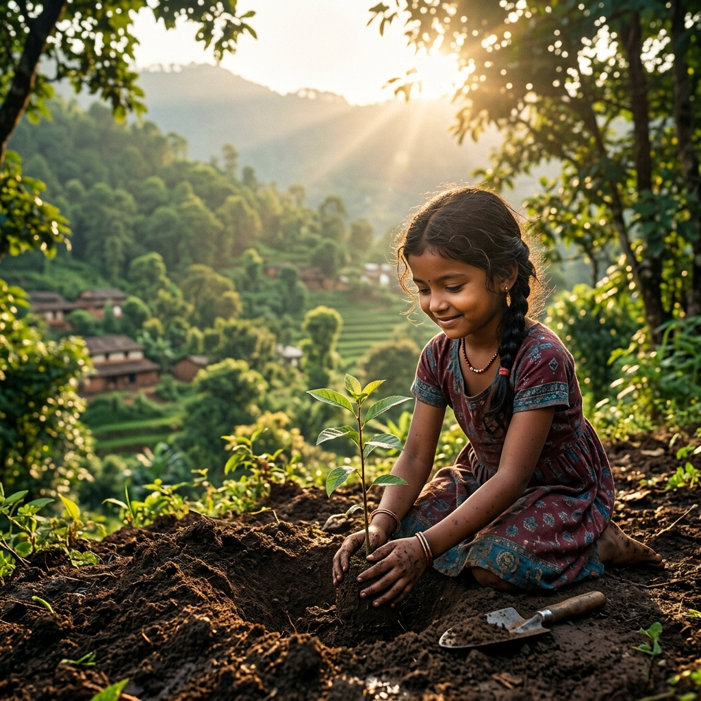

# Storyboard: "Prakriti Mitra" 60-Second Launch Film

This document outlines the cinematic storyboard and production script for the launch of **Prakriti Mitra**, an AI-powered sustainability intelligence platform. 

---

## Technical Specifications
- **Duration**: 60 seconds
- **Aspect Ratio**: 2.39:1 (Anamorphic Cinematic Widescreen)
- **Color Grade**: Warm golden hour sunlight, deep forest greens, rich earth browns, high contrast with organic glowing neon-green overlays.
- **Sound Design**: Orchestral-acoustic fusion (warm acoustic guitars, cello, swelling strings, and electronic micro-chimes indicating data calculation).

---

## Scene-by-Scene Storyboard

| Time | Scene | Visuals & Action | Camera Movement & Lens | Audio & Sound Design | Voiceover (VO) Narration |
| :--- | :--- | :--- | :--- | :--- | :--- |
| **0:00 - 0:07** | **1. The Awakening** | Sunrise breaking over mist-covered Indian valleys. A winding river reflects the gold sky. Deodars and agricultural step-farms slowly illuminate in the Western Ghats. | **Drone fly-over**: Slowly sweeping forward, starting low and rising over a ridge. *50mm anamorphic lens, shallow depth.* | Low, deep cello chord hums. Sounds of morning birds and wind rustling through deodar trees. | *(Soft, warm, resonant female voice)*: "Nature has always shared its rhythm with us. Silent. Balanced. Perfect." |
| **0:07 - 0:15** | **2. Human Connection** | A grandfather and granddaughter watering a small garden plot in a rural courtyard. A young boy cycles down a dusty lane towards a school. A woman turns off a tap after filling a copper pot. | **Medium tracking shot**: Moving alongside the bicycle. Quick pan to close-up of water droplet falling on a leaf. | Acoustic guitar gently enters, picking a warm, rhythmic melody. Water splash sound effect is crisp and amplified. | "But as our world moves faster, the footprints we leave behind fade from our sight." |
| **0:15 - 0:22** | **3. Celebration** | A vibrant Indian wedding outdoor reception. Laughing guests, colorful flowers, lights strung across banyan branches. Cut to a child blowing candles on a birthday cake. | **Jib shot**: Descending from banyan branches into the heart of the celebration. *Fast cuts to capture expressions.* | Faint sound of traditional shehnai and laughing guests, blending into the swelling orchestral strings. | "In every celebration we hold, in every choice we make..." |
| **0:22 - 0:32** | **4. The Hidden Footprint** | The same scenes, but details glow: A diesel generator hums, emitting a faint digital green grid of emissions (15%). A food buffet shows organic waste values floating above plates (25%). A family car has a glowing ribbon indicating petrol emissions (42%). | **Static macro shots & Match cuts**: Quick transitions showing the physical elements morphing into glowing green data nodes. | Music volume dips slightly; high-frequency digital scanning chimes trigger as indicators appear. | "...there lies an invisible impact. Carbon. Waste. Energy. Water. Hidden from our eyes. Until now." |
| **0:32 - 0:42** | **5. The Reveal** | A citizen taps a smartphone. The screen projects a holographic dashboard in the air: **Prakriti Family Score: 78**. In the village, a Panchayat head holds a tablet displaying a map showing tree canopy cover (34.5%) and water bodies in neon green. | **Steadicam orbit**: Circling the user as the glowing green UI dashboard interfaces track in 3D space. | Electronic chimes resolve into a harmonious major chord. Orchestral strings swell with hope. | "Introducing Prakriti Mitra. An AI-powered intelligence platform that makes sustainability visible." |
| **0:42 - 0:50** | **6. Scoring Impact** | Quick montage of dashboard values: **Event Score: 65 (Silver Event)**, **Student Score: 92 (Green Champion)**, and **Village Rank: #4**. Badges like "Bicycle Hero" and "Water Whisperer" rotate and glow. | **Rapid macro zoom-ins**: Focus on glowing score rings filling up, followed by close-ups of smiling faces. | Crisp, satisfying "click-unlock" sound effects as badges light up. The music beat accelerates. | "From families to events, school children to entire villages—we track, score, and guide our communities to heal the earth." |
| **0:50 - 0:55** | **7. Restoration** | Split screen: Left side shows a dry pond; right side shows it filling with clean water under a canopy. A barren hill transforms into a young forest. Village street solar grids light up sequentially. | **Time-lapse panning**: Seamless morphing of dry/depleted spaces into lush, restored environments. | Music reaches its emotional peak: full orchestra, sweeping strings, and warm French horns. | "Together, we turn metrics into forests, conservation into titles, and scores into a living heritage." |
| **0:55 - 1:00** | **8. The Seed of Hope** | Close-up of a child's hands pressing soil around a fresh native sapling. She looks up into the camera, smiling, as the warm golden sunlight catches her face. The camera pulls back into the sky. | **Drone overhead pull-back**: Moving vertically up, revealing a vast, green, thriving landscape. | Sound of a single, clear acoustic guitar strum, echoing out into natural forest sounds. | "Prakriti Mitra. Your guide to sustainable living." |

---

## Final Title Cards
*(A clean, deep-green screen fades in with golden text)*

**PRAKRITI MITRA**  
*Friend of Nature. Guide for Sustainable Living.*

---
*(Small text at bottom)*  
`Check Your Green Score Today. prakritimitra.org`
